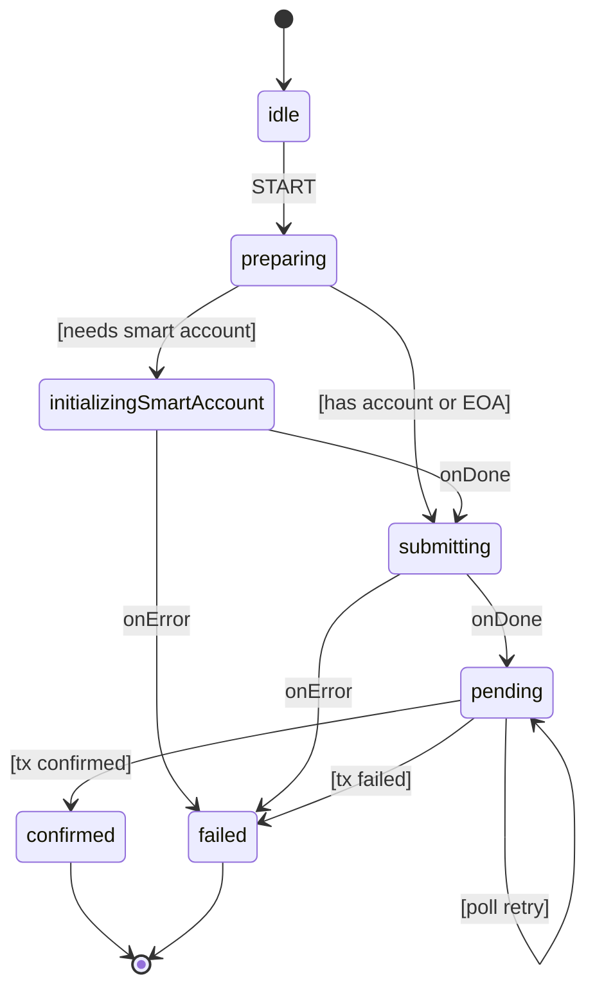

# Transaction Manager Specification

## Overview

The ENS Transaction Manager is a robust, type-safe transaction lifecycle management system built on XState v5 and neverthrow. It provides declarative state machine-based transaction handling with built-in persistence, recovery, and multi-transaction support.

## Table of Contents

1. [Architecture](#architecture)
2. [Design Decisions](#design-decisions)
3. [Core Features](#core-features)
4. [Transaction Lifecycle](#transaction-lifecycle)
5. [Persistence & Recovery](#persistence--recovery)
6. [Usage Patterns](#usage-patterns)
7. [API Reference](#api-reference)

---

## Architecture

### High-Level Architecture

```
┌─────────────────────────────────────────────────────────────────┐
│                    Application Layer                            │
│  ┌──────────────────┐  ┌──────────────────┐  ┌───────────────┐ │
│  │ UI Components    │  │ React Hooks      │  │ Providers     │ │
│  └──────────────────┘  └──────────────────┘  └───────────────┘ │
└─────────────────────────────────────────────────────────────────┘
                              │
                              ▼
┌─────────────────────────────────────────────────────────────────┐
│                  Transaction Registry Layer                      │
│  ┌──────────────────────────────────────────────────────────┐  │
│  │  TransactionRegistryMachine (XState v5)                  │  │
│  │  - Manages multiple transaction actors                   │  │
│  │  - Handles recovery on startup                           │  │
│  │  - Coordinates persistence                               │  │
│  └──────────────────────────────────────────────────────────┘  │
└─────────────────────────────────────────────────────────────────┘
                              │
                              ▼
┌─────────────────────────────────────────────────────────────────┐
│                  Transaction Machine Layer                       │
│  ┌──────────────────────────────────────────────────────────┐  │
│  │  TransactionMachine (XState v5)                          │  │
│  │  - Manages single transaction lifecycle                  │  │
│  │  - Handles EOA and Smart Account flows                   │  │
│  │  - Polls for confirmation                                │  │
│  └──────────────────────────────────────────────────────────┘  │
└─────────────────────────────────────────────────────────────────┘
                              │
                              ▼
┌─────────────────────────────────────────────────────────────────┐
│                    Service Layer                                 │
│  ┌──────────────┐  ┌──────────────┐  ┌────────────────────┐   │
│  │ Transaction  │  │ Rhinestone   │  │ ENS Renewal        │   │
│  │ Service      │  │ Helpers      │  │ Helpers            │   │
│  └──────────────┘  └──────────────┘  └────────────────────┘   │
└─────────────────────────────────────────────────────────────────┘
                              │
                              ▼
┌─────────────────────────────────────────────────────────────────┐
│                  Persistence Layer                               │
│  ┌──────────────────────────────────────────────────────────┐  │
│  │  IndexedDB (via idb)                                     │  │
│  │  - Active transactions store                             │  │
│  │  - Transaction history (max 1000)                        │  │
│  │  - Auto-pruning old entries                              │  │
│  └──────────────────────────────────────────────────────────┘  │
└─────────────────────────────────────────────────────────────────┘
```

### Component Relationships

```
TransactionRegistryProvider
  │
  ├─► TransactionRecoveryNotification
  │     └─► Shows recovered transactions on app load
  │
  ├─► GlobalTransactionToasts
  │     └─► Displays toast notifications for state changes
  │
  ├─► TransactionStatusPanel
  │     └─► Shows all active transactions
  │
  └─► Individual Transaction Actors
        └─► Each manages its own lifecycle
```

---

## Design Decisions

### 1. Why XState v5?

**Decision**: Use XState v5 for transaction state management instead of Redux, Zustand, or manual state.

**Rationale**:
- **Explicit State Modeling**: Transaction lifecycle has well-defined states (idle → preparing → submitting → pending → confirmed/failed)
- **Built-in State Visualization**: XState provides visual state charts for debugging
- **Actor Model**: Naturally supports managing multiple concurrent transactions
- **Type Safety**: First-class TypeScript support with inferred types
- **Testability**: State machines are inherently testable and predictable
- **Time-based Logic**: Built-in support for delays, retries, and polling
- **Event Sourcing**: All state transitions are logged and auditable

**Trade-offs**:
- ✅ More robust error handling and edge case management
- ✅ Self-documenting code (state chart is the spec)
- ✅ Easier to reason about complex async flows
- ❌ Steeper learning curve for developers unfamiliar with state machines
- ❌ Slightly more verbose initial setup

### 2. Why Functional Helpers over Class-based Services?

**Decision**: Use pure functional helpers for Rhinestone integration instead of class-based services.

**Rationale**:
- **Stateless by Design**: Functions don't hold mutable state, reducing bugs
- **Better Composability**: Functions can be easily combined and tested
- **Explicit Dependencies**: All dependencies are passed as parameters
- **Aligns with XState**: State machines manage state, helpers are pure computations
- **Tree-shaking**: Unused functions can be eliminated by bundlers
- **Simpler Testing**: No need to mock class instances or internal state

**Example**:
```typescript
// ✅ Functional approach
export async function initializeRhinestoneAccount(
  walletClient: WalletClient,
  config: RhinestoneAccountConfig
): Promise<Result<any, Error>>

// ❌ Class-based approach (avoided)
class RhinestoneAccountService {
  private rhinestoneAccount?: any  // Hidden mutable state
  constructor(private config: RhinestoneAccountConfig) {}
  async initializeSmartAccount(): Promise<Result<any, Error>>
}
```

### 3. Why neverthrow for Error Handling?

**Decision**: Use neverthrow's `Result` type instead of try-catch or error throwing.

**Rationale**:
- **Type-Safe Errors**: Errors are part of the return type signature
- **No Silent Failures**: Can't accidentally ignore errors
- **Composability**: Chain operations with `andThen`, `mapErr`, `orElse`
- **Railway-Oriented Programming**: Clear success/error paths
- **Integration with XState**: `fromResultAsync` actor helper eliminates boilerplate

**Example**:
```typescript
// ✅ With neverthrow
export async function prepareRenewal(...): Promise<Result<Data, Error>> {
  const priceResult = await getPrice(...)
  if (priceResult.isErr()) return err(priceResult.error)

  return ok({ value: priceResult.value })
}

// ❌ Without neverthrow (avoided)
export async function prepareRenewal(...): Promise<Data> {
  try {
    const price = await getPrice(...)
    return { value: price }
  } catch (error) {
    // Error might be swallowed or not properly typed
    throw new Error('Failed')
  }
}
```

### 4. Why IndexedDB over localStorage?

**Decision**: Use IndexedDB for transaction persistence instead of localStorage.

**Rationale**:
- **Storage Limits**: IndexedDB has much higher storage limits (>50MB vs ~5MB)
- **Structured Data**: Native support for complex objects and indexing
- **Performance**: Better for large datasets and queries
- **Transactions**: Built-in transaction support for data integrity
- **Background Access**: Can be accessed from Web Workers
- **Future-Proof**: Better for eventual Service Worker integration

**Trade-offs**:
- ✅ Can store 1000+ transactions without hitting limits
- ✅ Efficient querying by timestamp, status, etc.
- ✅ No need to JSON.stringify/parse manually
- ❌ Async-only API (but we're already async)
- ❌ More complex API (mitigated by `idb` wrapper library)

### 5. Why Transaction Registry Pattern?

**Decision**: Use a centralized transaction registry instead of component-local state.

**Rationale**:
- **Cross-Component Visibility**: Show transaction status anywhere in the app
- **Persistence**: Transactions survive component unmounts
- **Global Notifications**: Toasts and status updates work regardless of which component initiated the transaction
- **Recovery**: Single source of truth for recovering transactions after browser close
- **Debugging**: Centralized logging and monitoring

**Example**:
```typescript
// ✅ Registry pattern
const registry = useTransactionRegistry()
const txId = registry.startTransaction(request)
// Transaction continues even if component unmounts

// ❌ Component-local (avoided)
const [state, send] = useMachine(transactionMachine)
// Transaction lost on unmount
```

### 6. Why Context Caching for Rhinestone Accounts?

**Decision**: Cache initialized Rhinestone accounts in XState context instead of recreating them.

**Rationale**:
- **Reduce Wallet Popups**: Avoid multiple signature requests for the same account
- **Performance**: Account initialization is expensive (SDK calls, signatures)
- **User Experience**: Less friction when executing multiple transactions
- **State Preservation**: Account object persists across transaction retries

**Implementation**:
```typescript
context: {
  rhinestoneAccount: undefined,  // Cached after first initialization
}

states: {
  initializingSmartAccount: {
    invoke: {
      onDone: {
        actions: assign({
          rhinestoneAccount: ({ event }) => event.output  // Cache it
        })
      }
    }
  },
  preparing: {
    always: [
      {
        guard: ({ context }) => !!context.rhinestoneAccount,
        target: 'submitting'  // Skip initialization if cached
      }
    ]
  }
}
```

### 7. Why Separate Active and History Stores?

**Decision**: Use separate IndexedDB object stores for active transactions and history.

**Rationale**:
- **Query Performance**: Separate stores allow faster queries for active transactions
- **Data Lifecycle**: Different retention policies (active = temporary, history = long-term)
- **Archival**: Easy to archive completed transactions without affecting active ones
- **Pruning**: Can implement different pruning strategies per store

**Schema**:
```typescript
// Active Store: Transactions currently in-flight
{
  id: string
  status: 'preparing' | 'submitting' | 'pending'
  timestamp: number
  updatedAt: number
}

// History Store: Completed/failed transactions (max 1000)
{
  id: string
  status: 'confirmed' | 'failed'
  timestamp: number
  updatedAt: number
}
```

---

## Core Features

### 1. Transaction Lifecycle Management

The transaction machine models the complete lifecycle:

```
┌──────┐  START   ┌──────────┐  submit  ┌───────────┐
│ idle ├─────────►│preparing ├─────────►│submitting │
└──────┘          └──────────┘          └─────┬─────┘
                                              │
                                              ▼
                   ┌───────────┐        ┌─────────┐
                   │ confirmed │◄───────┤ pending │
                   └───────────┘  poll  └────┬────┘
                                              │
                                              ▼
                                        ┌─────────┐
                                        │ failed  │
                                        └─────────┘
```

**States**:
- `idle`: Waiting to start
- `preparing`: Preparing transaction data (encoding, gas estimation)
- `initializingSmartAccount`: Creating/loading Rhinestone account (if needed)
- `submitting`: Sending transaction to network
- `pending`: Waiting for confirmation
- `confirmed`: Transaction mined successfully
- `failed`: Transaction failed or reverted

### 2. Multi-Account Support

**EOA (Externally Owned Account)**:
```typescript
{
  type: 'eoa',
  to: '0x...',
  data: '0x...',
  value: 1000000n,
  from: '0x...',
  chainId: 11155111
}
```

**Rhinestone Smart Account**:
```typescript
{
  type: 'rhinestone-intent',
  to: '0x...',
  data: '0x...',
  value: 1000000n,
  from: '0x...',
  chainId: 11155111,
  rhinestoneParams: {
    name: 'myname',
    duration: 31536000n
  }
}
```

The machine automatically detects the transaction type and routes to the appropriate flow.

### 3. Automatic Persistence

Every state change is automatically persisted to IndexedDB:

```typescript
actor.subscribe((snapshot) => {
  const persisted: PersistedTransaction = {
    id: transactionId,
    request: transactionRequest,
    hash: snapshot.context.hash,
    status: snapshot.value,
    error: snapshot.context.error?.message,
    timestamp: originalTimestamp,
    updatedAt: Date.now()
  }

  if (state === 'confirmed' || state === 'failed') {
    archiveTransaction(persisted)  // Move to history
  } else {
    saveActiveTransaction(persisted)  // Keep in active store
  }
})
```

### 4. Transaction Recovery

On app startup, the registry:
1. Loads all active transactions from IndexedDB
2. Spawns transaction actors for each one
3. Resumes from their last known state
4. Continues polling for pending transactions

```typescript
states: {
  recovering: {
    invoke: {
      src: 'recoverTransactions',
      onDone: {
        target: 'idle',
        actions: assign({
          recoveredTransactions: ({ event }) => event.output
        })
      }
    }
  }
}
```

### 5. Transaction History (Max 1000 Entries)

The persistence layer automatically prunes old history entries:

```typescript
async function pruneHistory(db: IDBPDatabase): Promise<void> {
  const allEntries = await index.getAll()

  if (allEntries.length > MAX_HISTORY_SIZE) {
    const entriesToDelete = allEntries.length - MAX_HISTORY_SIZE
    const sortedByTimestamp = allEntries.sort((a, b) =>
      a.timestamp - b.timestamp
    )

    // Delete oldest entries first
    for (let i = 0; i < entriesToDelete; i++) {
      await store.delete(sortedByTimestamp[i].id)
    }
  }
}
```

---

## Transaction Lifecycle

### State Diagram



### State Transitions

| From State | Event/Guard | To State | Actions |
|-----------|------------|----------|---------|
| idle | START | preparing | Initialize context |
| preparing | [EOA] | submitting | Prepare transaction data |
| preparing | [Smart Account + no cached account] | initializingSmartAccount | Check cache |
| preparing | [Smart Account + cached account] | submitting | Reuse cached account |
| initializingSmartAccount | onDone | submitting | Cache account in context |
| initializingSmartAccount | onError | failed | Record error |
| submitting | onDone | pending | Store transaction hash |
| submitting | onError | failed | Record error |
| pending | [receipt found] | confirmed | Store receipt |
| pending | [max retries] | failed | Timeout error |
| pending | [retry delay] | pending | Continue polling |

### Context Evolution

```typescript
// Initial
{
  request: TransactionRequest,
  hash: undefined,
  receipt: undefined,
  error: undefined,
  rhinestoneAccount: undefined
}

// After initializingSmartAccount
{
  request: TransactionRequest,
  hash: undefined,
  receipt: undefined,
  error: undefined,
  rhinestoneAccount: <RhinestoneAccount>  // ✅ Cached!
}

// After submitting
{
  request: TransactionRequest,
  hash: '0xabc123...',
  receipt: undefined,
  error: undefined,
  rhinestoneAccount: <RhinestoneAccount>
}

// After confirmed
{
  request: TransactionRequest,
  hash: '0xabc123...',
  receipt: <TransactionReceipt>,
  error: undefined,
  rhinestoneAccount: <RhinestoneAccount>
}
```

---

## Persistence & Recovery

### IndexedDB Schema

**Database**: `ens-transaction-manager`

**Object Stores**:

1. **active-transactions**
   - Key: `id` (string)
   - Indexes: `status`, `timestamp`
   - Purpose: Store in-flight transactions

2. **transaction-history**
   - Key: `id` (string)
   - Indexes: `status`, `timestamp`
   - Purpose: Store completed/failed transactions
   - Max size: 1000 entries (auto-pruned)

### Persistence Flow

```
Transaction State Change
    │
    ├─► Active (preparing/submitting/pending)
    │     └─► saveActiveTransaction()
    │           └─► db.put('active-transactions', data)
    │
    └─► Terminal (confirmed/failed)
          └─► archiveTransaction()
                ├─► db.put('transaction-history', data)
                ├─► db.delete('active-transactions', id)
                └─► pruneHistory() [if > 1000 entries]
```

### Recovery Flow

```
App Startup
    │
    └─► TransactionRegistryProvider mounts
          │
          └─► Registry enters 'recovering' state
                │
                ├─► getActiveTransactions()
                │     └─► db.getAll('active-transactions')
                │
                └─► For each recovered transaction:
                      │
                      ├─► Spawn transaction actor
                      │
                      ├─► Resume from last state
                      │
                      └─► If pending + hash exists:
                            └─► Continue polling for confirmation
```

### Example Recovery Scenario

**Scenario**: User closes browser tab while transaction is pending.

1. **Before close**:
   ```json
   {
     "id": "tx-1234",
     "status": "pending",
     "hash": "0xabc123...",
     "timestamp": 1699999999000
   }
   ```

2. **On app restart**:
   - Registry loads transaction from IndexedDB
   - Spawns actor with `resumeFromPending: true`
   - Actor transitions directly to `pending` state
   - Starts polling for transaction receipt
   - Updates status to `confirmed` or `failed`
   - Archives to history

---

## Usage Patterns

### Basic Setup

```typescript
import { TransactionRegistryProvider } from '@ens-apps/transaction-manager'

function App() {
  return (
    <TransactionRegistryProvider>
      <YourApp />
    </TransactionRegistryProvider>
  )
}
```

### Starting a Transaction

```typescript
import { useTransactionRegistry } from '@ens-apps/transaction-manager'
import { prepareENSRenewal } from '@ens-apps/transaction-manager'

function RenewButton() {
  const { startTransaction } = useTransactionRegistry()
  const { data: publicClient } = usePublicClient()
  const { data: walletClient } = useWalletClient()

  const handleRenew = async () => {
    const result = await prepareENSRenewal({
      publicClient,
      walletClient,
      name: 'myname',
      duration: 31536000n,
      chainId: 11155111,
      useSmartAccount: true,
      rhinestoneConfig: {
        rhinestoneApiKey: 'your-api-key'
      }
    })

    if (result.isOk()) {
      const txId = startTransaction(result.value.request)
      console.log('Transaction started:', txId)
    }
  }

  return <button onClick={handleRenew}>Renew</button>
}
```

### Monitoring Transaction Status

```typescript
import { useTransaction } from '@ens-apps/transaction-manager'
import { useSelector } from '@xstate/react'

function TransactionStatus({ txId }: { txId: string }) {
  const actor = useTransaction(txId)
  const state = useSelector(actor, (s) => s.value)
  const hash = useSelector(actor, (s) => s.context.hash)

  return (
    <div>
      <p>Status: {state}</p>
      {hash && <p>Hash: {hash}</p>}
    </div>
  )
}
```

### Global Notifications

```typescript
import {
  TransactionRecoveryNotification,
  GlobalTransactionToasts,
  TransactionStatusPanel
} from '@ens-apps/transaction-manager'

function App() {
  return (
    <TransactionRegistryProvider>
      <TransactionRecoveryNotification autoRecover />
      <GlobalTransactionToasts autoDismiss={5000} />
      <TransactionStatusPanel position="bottom-left" />

      <YourApp />
    </TransactionRegistryProvider>
  )
}
```

### Custom Toast Rendering

```typescript
<GlobalTransactionToasts
  render={(toasts, onDismiss) => (
    <div className="custom-toast-container">
      {toasts.map(toast => (
        <CustomToast
          key={toast.id}
          {...toast}
          onClose={() => onDismiss(toast.id)}
        />
      ))}
    </div>
  )}
/>
```

### Querying Transaction History

```typescript
import { getTransactionHistory } from '@ens-apps/transaction-manager'

async function showHistory() {
  const history = await getTransactionHistory(50) // Last 50 transactions

  history.forEach(tx => {
    console.log(`${tx.id}: ${tx.status} at ${new Date(tx.timestamp)}`)
  })
}
```

---

## API Reference

### Components

#### `TransactionRegistryProvider`
Provides transaction registry context to the app.

**Props**: None (except `children`)

#### `TransactionRecoveryNotification`
Shows notification when transactions are recovered.

**Props**:
- `render?: (props) => ReactNode` - Custom render function
- `autoRecover?: boolean` - Auto-recover without showing notification

#### `GlobalTransactionToasts`
Displays toast notifications for transaction events.

**Props**:
- `render?: (toasts, onDismiss) => ReactNode` - Custom render
- `autoDismiss?: number` - Auto-dismiss duration (ms)
- `maxToasts?: number` - Max toasts to show
- `enabled?: boolean` - Enable/disable toasts

#### `TransactionStatusPanel`
Shows panel with all active transactions.

**Props**:
- `render?: (transactions, onCancel) => ReactNode` - Custom render
- `filter?: string[]` - Show only specific states
- `maxTransactions?: number` - Limit displayed transactions
- `position?: 'top-left' | 'top-right' | 'bottom-left' | 'bottom-right'`
- `enabled?: boolean` - Enable/disable panel

### Hooks

#### `useTransactionRegistry()`
Returns registry context.

**Returns**:
```typescript
{
  actor: ActorRefFrom<typeof transactionRegistryMachine>
  state: any
  startTransaction: (request: TransactionRequest, id?: string) => string
  cancelTransaction: (id: string) => void
  recoverTransactions: () => void
  clearRecovered: () => void
  hasRecoveredTransactions: boolean
}
```

#### `useTransaction(id: string)`
Returns actor for specific transaction.

**Returns**: `ActorRefFrom<typeof transactionMachine> | undefined`

#### `useActiveTransactions()`
Returns map of all active transaction actors.

**Returns**: `Map<string, ActorRefFrom<any>>`

#### `useRecoveredTransactions()`
Returns list of recovered transactions (before restart).

**Returns**: `PersistedTransaction[]`

### Helpers

#### `prepareENSRenewal(params)`
Prepares ENS renewal transaction.

**Params**:
```typescript
{
  publicClient: PublicClient
  walletClient?: WalletClient
  name: string
  duration: bigint
  chainId: number
  useSmartAccount?: boolean
  rhinestoneConfig?: RhinestoneAccountConfig
}
```

**Returns**: `Promise<Result<ENSRenewalTransactionData, Error>>`

#### `getENSRenewalPrice(publicClient, name, duration)`
Gets renewal price for ENS name.

**Returns**: `Promise<Result<bigint, Error>>`

#### `initializeRhinestoneAccount(walletClient, config)`
Initializes a Rhinestone smart account.

**Returns**: `Promise<Result<any, RhinestoneAccountError>>`

#### `executeENSRenewal(rhinestoneAccount, publicClient, params, config)`
Executes ENS renewal via Rhinestone account.

**Returns**: `Promise<Result<Hex, RhinestoneAccountError>>`

### Persistence Functions

#### `saveActiveTransaction(transaction)`
Save transaction to active store.

**Returns**: `Promise<void>`

#### `getActiveTransactions()`
Get all active transactions.

**Returns**: `Promise<PersistedTransaction[]>`

#### `archiveTransaction(transaction)`
Move transaction to history.

**Returns**: `Promise<void>`

#### `getTransactionHistory(limit?)`
Get transaction history (most recent first).

**Returns**: `Promise<PersistedTransaction[]>`

#### `clearActiveTransactions()`
Clear all active transactions (debugging).

**Returns**: `Promise<void>`

#### `clearTransactionHistory()`
Clear all history (debugging).

**Returns**: `Promise<void>`

---

## Conclusion

The Transaction Manager provides a robust foundation for managing blockchain transactions with:

✅ **Type Safety** - Full TypeScript support with neverthrow Result types
✅ **Reliability** - State machine-based lifecycle with automatic recovery
✅ **Persistence** - IndexedDB storage with 1000-entry history
✅ **User Experience** - Context caching reduces wallet popups
✅ **Multi-Transaction** - Registry pattern supports concurrent transactions
✅ **Extensibility** - Custom render functions for all UI components
✅ **Observability** - Built-in logging and state visualization

This architecture is production-ready and can be extended to support additional transaction types, chains, and account abstraction methods.
