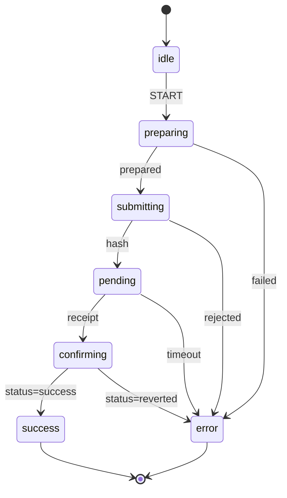

# Transaction States Documentation

This folder contains detailed documentation for each state in the transaction machine state flow.

## State Flow Overview

```
idle → preparing → submitting → pending → confirming → success
         ↓            ↓           ↓            ↓
       error        error       error        error
```

## Available State Documentation

### Happy Path States

| State | Description | Documentation |
|-------|-------------|---------------|
| **idle** | Initial state, waiting for transaction intent | [IDLE.md](./IDLE.md) |
| **preparing** | Preparing transaction (get price, encode data, estimate gas) | [PREPARING.md](./PREPARING.md) |
| **submitting** | Signing and broadcasting transaction (waiting for hash) | [SUBMITTING.md](./SUBMITTING.md) |
| **pending** | Waiting for transaction to be mined (waiting for receipt) | [PENDING.md](./PENDING.md) |
| **confirming** | Verifying transaction succeeded or reverted | [CONFIRMING.md](./CONFIRMING.md) |
| **success** | Transaction completed successfully | [SUCCESS.md](./SUCCESS.md) |

### Error States

Error states are documented separately in [ERROR_STATES.md](./ERROR_STATES.md) (coming soon)

## Quick Reference

### What Each State Waits For

| State | Waiting For | Returns | Duration |
|-------|-------------|---------|----------|
| idle | User intent | - | Instant |
| preparing | Blockchain reads + encoding | TransactionRequest | 1-5 seconds |
| submitting | User approval + broadcast | Transaction hash | 1-30 seconds |
| pending | Transaction mining | Transaction receipt | 12-60 seconds |
| confirming | - (instant check) | Success/Revert | Instant |
| success | - (terminal) | - | Terminal |

### What Each State Produces

| State | Input | Output | Context Changes |
|-------|-------|--------|-----------------|
| idle | - | intent, signer, chainId | Sets intent, signer |
| preparing | intent, publicClient | request, estimatedCost | Sets request, estimatedCost |
| submitting | request, signer | hash | Sets hash |
| pending | hash, publicClient | receipt | Sets receipt |
| confirming | receipt | - | Sets error (if reverted) |
| success | - | - | - |

## State Transitions

### Success Flow
```
START event
   ↓
idle → preparing
   ↓ (preparation complete)
preparing → submitting
   ↓ (hash received)
submitting → pending
   ↓ (receipt received)
pending → confirming
   ↓ (status checked)
confirming → success  ✅
```

### Error Flows

**Preparation Error:**
```
preparing → error.preparation
(Invalid intent, blockchain read failed, encoding error)
```

**Submission Error:**
```
submitting → error.submission
(User rejected, insufficient funds, network error)

OR

submitting → retrying → submitting
(Network error with retries available)
```

**Timeout Error:**
```
pending → error.timeout
(Transaction not mined within timeout)

OR

pending → checkingFallback → pending
(Try eth_call to verify if transaction succeeded)
```

**Revert Error:**
```
confirming → error.reverted
(Transaction mined but execution failed)
```

## Understanding State Context

The machine context evolves as it progresses through states:

### After `idle`
```typescript
{
  publicClient: PublicClient,
  intent: TransactionIntent,      // ✅ Set
  signer: Signer,                  // ✅ Set
  chainId: number,                 // ✅ Set
  useSmartAccount: boolean,        // ✅ Set
  request: undefined,
  hash: undefined,
  receipt: undefined,
}
```

### After `preparing`
```typescript
{
  // ... previous context, plus:
  request: TransactionRequest,     // ✅ Set
  estimatedCost: bigint,           // ✅ Set
}
```

### After `submitting`
```typescript
{
  // ... previous context, plus:
  hash: Hash,                      // ✅ Set
}
```

### After `pending`
```typescript
{
  // ... previous context, plus:
  receipt: TransactionReceipt,     // ✅ Set
}
```

### After `confirming` (success)
```typescript
{
  // ... all previous context
  // No new fields - stays in success state
}
```

## Common Patterns

### Pattern 1: Track Current State
```typescript
const txState = useSelector(txActor, (s) => s?.value)

// State value examples:
// 'idle'
// 'preparing'
// 'submitting'
// 'pending'
// 'confirming'
// 'success'
// 'error.preparation'
// 'error.submission'
// 'error.timeout'
// 'error.reverted'
```

### Pattern 2: Access State-Specific Data
```typescript
const txHash = useSelector(txActor, (s) => s?.context.hash)
// Available after: submitting, pending, confirming, success

const txReceipt = useSelector(txActor, (s) => s?.context.receipt)
// Available after: pending, confirming, success

const txError = useSelector(txActor, (s) => s?.context.error)
// Available in: error.* states
```

### Pattern 3: Conditional UI Based on State
```typescript
import { match } from 'ts-pattern'

{match(txState)
  .with('idle', () => <ReadyButton />)
  .with('preparing', () => <PreparingSpinner />)
  .with('submitting', () => <WalletPrompt />)
  .with('pending', () => <MiningProgress hash={txHash} />)
  .with('confirming', () => <VerifyingSpinner />)
  .with('success', () => <SuccessMessage receipt={txReceipt} />)
  .with(P.string.startsWith('error'), () => <ErrorMessage error={txError} />)
  .exhaustive()}
```

## Testing States

Each state document includes testing examples. For comprehensive testing:

```typescript
import { createActor } from 'xstate'
import { transactionMachine } from '@ens-apps/transaction-manager'
import { waitFor } from '@testing-library/react'

describe('Transaction State Flow', () => {
  test('complete happy path', async () => {
    const actor = createActor(transactionMachine, {
      input: { /* mock inputs */ }
    })

    actor.start()

    // 1. Idle
    expect(actor.getSnapshot().value).toBe('idle')

    // 2. Send START event
    actor.send({ type: 'START', intent, signer, chainId })

    // 3. Preparing
    await waitFor(() => {
      expect(actor.getSnapshot().value).toBe('preparing')
    })

    // 4. Submitting
    await waitFor(() => {
      expect(actor.getSnapshot().value).toBe('submitting')
      expect(actor.getSnapshot().context.request).toBeDefined()
    })

    // 5. Pending
    await waitFor(() => {
      expect(actor.getSnapshot().value).toBe('pending')
      expect(actor.getSnapshot().context.hash).toBeDefined()
    })

    // 6. Confirming
    await waitFor(() => {
      expect(actor.getSnapshot().value).toBe('confirming')
      expect(actor.getSnapshot().context.receipt).toBeDefined()
    })

    // 7. Success
    await waitFor(() => {
      expect(actor.getSnapshot().value).toBe('success')
    })
  })
})
```

## Debugging States

### View State History
```typescript
import { getTransitionHistory } from '@ens-apps/transaction-manager'

const history = getTransitionHistory('transaction')
console.log(history)

// Output:
// [
//   { from: undefined, to: 'idle', event: 'xstate.init', timestamp: ... },
//   { from: 'idle', to: 'preparing', event: 'START', timestamp: ... },
//   { from: 'preparing', to: 'submitting', event: 'xstate.done.actor...', timestamp: ... },
//   // ...
// ]
```

### Generate Debug Report
```typescript
import { generateDebugReport } from '@ens-apps/transaction-manager'

const report = generateDebugReport()
console.log(report)
```

## Related Documentation

- [ARCHITECTURE.md](../ARCHITECTURE.md) - Overall system architecture
- [TRANSACTION_FLOW.md](../TRANSACTION_FLOW.md) - Complete transaction lifecycle
- [SIGNERS.md](../SIGNERS.md) - How signing works
- [README.md](../README.md) - Main documentation index

## State Machine Visualization

For a visual representation of the state machine, you can use XState's visualization tools:

1. **XState Inspector** (development):
```typescript
import { inspect } from '@xstate/inspect'

inspect({ iframe: false })
```

2. **Stately Editor** (design):
Visit https://stately.ai/viz and paste the machine definition

3. **Mermaid Diagram** (documentation):


## Contributing

When adding new states or modifying existing ones:

1. Update the relevant state documentation file
2. Update this README with the new state
3. Update state flow diagrams
4. Add testing examples
5. Update related documentation (TRANSACTION_FLOW.md, ARCHITECTURE.md)
